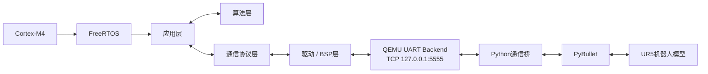
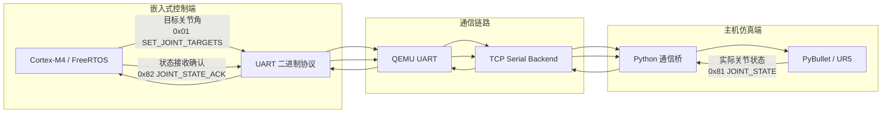

# 第1阶段：系统技术方案设计文档

## 1. 文档目的

本项目面向六轴工业机器人嵌入式运动控制固件开发与仿真验证，基于 ARM Cortex-M4、FreeRTOS、QEMU、Python 和 PyBullet 建立完整的软件开发与验证链路。

第1阶段主要完成系统总体架构设计、嵌入式基础工程、机器人仿真环境以及固件与仿真端之间的通信链路设计。

本文档用于明确：

- 系统总体软件架构；
- 驱动层、通信层、算法层和应用层的职责边界；
- Cortex-M4 / FreeRTOS 主控平台方案；
- PyBullet / UR5 仿真方案；
- 嵌入式端与仿真端之间的通信协议；
- 各模块之间的主要接口；
- 后续阶段的扩展边界。

---

## 2. 系统总体架构

系统由嵌入式控制端、通信链路和机器人仿真端三部分组成。



当前第1阶段已经建立以下最小闭环：



其中 TCP 仅作为 QEMU UART 在主机侧的后端传输方式，不改变嵌入式端的 UART 通信模型。

---

## 3. 软件分层设计

### 3.1 驱动层 / BSP

驱动层负责处理底层硬件资源，不直接理解机器人运动控制的业务语义。

当前涉及的底层资源包括：

- 系统时钟；
- GPIO；
- UART；
- 后续阶段扩展的 Timer；
- 后续实际机器人平台中的电机驱动接口。

当前工程中已经建立：

```text
board_clock_init()
board_gpio_init()
uart_init()
uart_write()
uart_read_byte()
```

其中：

- `board_clock_init()` 提供系统时钟初始化接口；
- `board_gpio_init()` 提供 GPIO 初始化工程模板；
- UART 完成 Cortex-M4 与外部仿真环境之间的字节收发。

当前 QEMU 平台采用 `mps2-an386`，系统时钟按照 25 MHz 配置。

GPIO 部分在当前仿真平台主要完成工程接口和寄存器访问模板，用于保证 BSP 层结构完整；后续迁移实际 MCU 时，可在不修改上层接口的情况下替换底层实现。

后续第2阶段将进一步完成 UART、Timer、GPIO 的标准化驱动封装。

---

### 3.2 通信层

通信层负责在嵌入式端与 Python 仿真端之间传输结构化数据。

其主要职责包括：

- 数据帧构造；
- 帧头同步；
- 命令类型识别；
- Payload 长度检查；
- 字节序转换；
- 数据校验；
- 六轴关节数据编码与解码。

通信层不直接操作机器人电机，也不负责运动学或轨迹规划。

当前嵌入式侧主要接口为：

```c
void protocol_build_joint_target_frame(
    const int16_t joints[6],
    uint8_t frame[17]
);

uint8_t protocol_parse_joint_state_frame(
    const uint8_t frame[17],
    int16_t joints[6]
);

void protocol_build_joint_state_ack_frame(
    const int16_t joints[6],
    uint8_t frame[17]
);
```

Python 端提供对应的数据帧构造、提取和解析逻辑。

---

### 3.3 应用层

应用层负责组织 FreeRTOS 任务，并协调通信层、驱动层及后续算法层。

当前第1阶段主要包含两个任务：

| 任务 | 功能 | 当前周期 |
|---|---|---:|
| `ProtocolTX` | 周期发送六轴目标角 | 1000 ms |
| `ProtocolRX` | 接收并解析仿真端状态 | 1 ms轮询 |

两个任务当前均运行在 FreeRTOS 调度器中。

`ProtocolTX` 的基本流程：

```text
生成六轴目标角
      ↓
协议打包
      ↓
UART发送
```

`ProtocolRX` 的基本流程：

```text
UART接收字节
      ↓
识别帧头
      ↓
收满完整数据帧
      ↓
校验并解析
      ↓
返回状态确认帧
```

后续阶段将在应用层进一步增加：

- 轨迹规划任务；
- PID闭环控制任务；
- 状态监测任务；
- 参数管理与异常处理。

---

### 3.4 算法层

算法层负责机器人运动控制相关计算，与底层硬件和通信方式解耦。

根据项目后续阶段要求，该层计划包括：

```text
算法层
├── 正运动学
├── 逆运动学
├── 最优逆解选择
├── 关节空间轨迹规划
├── 笛卡尔空间轨迹规划
└── PID位置闭环控制
```

第1阶段不提前实现上述算法，只确定模块边界。

后续算法模块应通过标准化关节位置、速度和机器人位姿数据结构与应用层交互，而不直接访问 UART、GPIO 等底层资源。

---

### 3.5 仿真层

仿真端采用：

- Python 3.11；
- PyBullet；
- UR5 六轴工业机器人 URDF 模型。

当前仿真工程主要负责：

- URDF 模型加载；
- Visual / Collision Mesh 加载；
- 六轴关节识别；
- 关节位置控制；
- 关节状态读取；
- 环境物体添加；
- 仿真视角切换；
- 与 Cortex-M4 控制端进行通信。

UR5 当前使用以下六个运动关节：

```text
shoulder_pan_joint
shoulder_lift_joint
elbow_joint
wrist_1_joint
wrist_2_joint
wrist_3_joint
```

仿真中采用 PyBullet `POSITION_CONTROL` 进行基础关节位置控制。

---

## 4. Cortex-M4 与实时操作系统方案

### 4.1 主控平台

当前采用：

```text
CPU架构：ARM Cortex-M4
QEMU Machine：mps2-an386
交叉编译器：arm-none-eabi-gcc
构建系统：CMake + Ninja
实时操作系统：FreeRTOS
开发环境：VS Code
```

在无实际 MCU 开发板的条件下，QEMU 用于运行 Cortex-M4 固件并模拟 UART 等基础资源。

---

### 4.2 启动流程

当前固件启动流程如下：

```text
Reset
  ↓
startup.s
  ↓
初始化 .data
  ↓
清零 .bss
  ↓
main()
  ↓
board_clock_init()
  ↓
board_gpio_init()
  ↓
uart_init()
  ↓
创建 FreeRTOS Tasks
  ↓
vTaskStartScheduler()
```

`startup.s` 同时配置 FreeRTOS 所需异常入口，包括：

- SVC；
- PendSV；
- SysTick。

---

### 4.3 构建方案

工程使用 CMake 管理 Cortex-M4 固件构建。

ARM 交叉编译 Toolchain 文件：

```text
cmake/arm-none-eabi-gcc.cmake
```

主要编译选项包括：

```text
-mcpu=cortex-m4
-mthumb
-ffreestanding
-fno-builtin
-nostdlib
```

链接过程使用工程自定义：

```text
linker.ld
```

最终生成：

```text
freertos_demo.elf
```

用于 QEMU 运行。

VS Code `tasks.json` 同时保留快速编译和运行任务，便于开发阶段操作。

---

## 5. 通信链路设计

### 5.1 链路结构

通信路径如下：

```text
Cortex-M4
   ↓
模拟 UART 寄存器
   ↓
QEMU
   ↓
TCP Serial Backend
127.0.0.1:5555
   ↓
Python Socket
   ↓
PyBullet
```

反方向使用同一条链路返回关节状态。

---

### 5.2 二进制帧格式

当前采用固定格式：

| 字段 | 长度 | 说明 |
|---|---:|---|
| Header | 2 Byte | 固定 `0xAA 0x55` |
| Command | 1 Byte | 消息类型 |
| Length | 1 Byte | Payload长度 |
| Payload | 12 Byte | 六个 `int16_t` 关节数据 |
| Checksum | 1 Byte | 字节和校验 |

完整帧长度：

```text
17 Byte
```

结构：

```text
+--------+---------+--------+-------------+----------+
| Header | Command | Length |   Payload   | Checksum |
+--------+---------+--------+-------------+----------+
| 2 Byte | 1 Byte  | 1 Byte |   12 Byte   | 1 Byte   |
+--------+---------+--------+-------------+----------+
```

---

### 5.3 字节序与角度表示

多字节数据采用 Little Endian。

关节角采用：

```text
signed int16
单位：0.01°
```

例如：

```text
60.00° -> 6000
10.00° -> 1000
-45.00° -> -4500
```

这样能够避免 Cortex-M4 与 Python 之间直接传输浮点数时产生的平台表示差异。

---

### 5.4 Command定义

| Command | 名称 | 方向 | 说明 |
|---:|---|---|---|
| `0x01` | `SET_JOINT_TARGETS` | Cortex-M4 → Python | 下发六轴目标角 |
| `0x81` | `JOINT_STATE` | Python → Cortex-M4 | 上报六轴实际角度 |
| `0x82` | `JOINT_STATE_ACK` | Cortex-M4 → Python | 确认状态帧已成功解析 |

---

### 5.5 Checksum

Checksum计算范围：

```text
Command + Length + Payload
```

不包含：

```text
0xAA 0x55
```

计算方式：

```text
checksum =
    (所有参与字段字节之和) & 0xFF
```

该校验方式用于第1阶段基础连通性验证。

后续通信模块开发阶段可根据可靠性要求升级为 CRC16 等更强的数据完整性校验方式。

---

## 6. 仿真控制方案

Python 通信桥解析 `0x01` 后，将六轴目标角从 degree 转换为 rad，并使用：

```python
p.setJointMotorControlArray(...)
```

向 UR5 六个关节下发位置控制目标。

当前使用的最大控制力矩配置为：

```text
Joint 1：150
Joint 2：150
Joint 3：150
Joint 4：28
Joint 5：28
Joint 6：28
```

仿真循环约以：

```text
240 Hz
```

运行。

Python 每：

```text
0.2 s
```

读取一次六轴实际关节位置，并通过 `0x81 JOINT_STATE` 返回 Cortex-M4。

---

## 7. 模块接口关系

系统各层之间的主要数据关系如下：

```text
应用层
  │
  │ 六轴目标角
  ▼
通信层
  │
  │ 二进制帧
  ▼
UART驱动
  │
  ▼
QEMU / Python
  │
  ▼
PyBullet
  │
  │ 六轴实际角度
  ▼
通信层
  │
  ▼
应用层
```

各层遵循以下原则：

1. 驱动层只负责硬件访问；
2. 通信层只负责数据编码、解析和校验；
3. 算法层只负责运动控制计算；
4. 应用层负责模块组织和任务调度；
5. 仿真端作为机器人本体和传感反馈的替代环境；
6. 模块之间通过明确接口传递数据，避免跨层直接访问。

---

## 8. 工程目录规划

当前工程按功能划分：

```text
six-axis-robot-motion-control/
├── CMakeLists.txt
├── README.md
│
├── cmake/
│   └── arm-none-eabi-gcc.cmake
│
├── firmware/
│   ├── hello/
│   └── freertos_demo/
│       ├── startup.s
│       ├── linker.ld
│       ├── main.c
│       ├── board.c
│       ├── board.h
│       ├── protocol.c
│       ├── protocol.h
│       ├── memory.c
│       ├── FreeRTOSConfig.h
│       └── CMakeLists.txt
│
├── simulation/
│   ├── pybullet_ur5/
│   │   ├── models/
│   │   └── src/
│   │
│   └── uart_bridge/
│       ├── uart_receiver.py
│       └── ur5_uart_bridge.py
│
├── third_party/
│   └── FreeRTOS-Kernel/
│
├── docs/
│
├── .vscode/
│   └── tasks.json
│
└── .gitignore
```

其中第三方 FreeRTOS Kernel 不直接提交至主仓库，通过独立依赖方式获取。

---

## 9. 第1阶段验证结果

当前系统已经完成以下验证：

### 9.1 Cortex-M4 / FreeRTOS

已验证：

- Cortex-M4 裸机程序运行；
- UART字符输出；
- FreeRTOS任务创建；
- FreeRTOS任务调度；
- `vTaskDelay()` 延时；
- 双任务并发运行；
- CMake交叉编译；
- Board初始化模板加入后主链回归正常。

### 9.2 PyBullet / UR5

已验证：

- PyBullet GUI运行；
- UR5 URDF加载；
- Visual / Collision Mesh加载；
- 六轴关节识别；
- 单关节位置控制；
- 环境物体添加；
- 多视角切换。

### 9.3 双向通信闭环

测试目标：

```text
Joint 1 = 60°
Joint 2~6 = 0°
```

实际链路：

```text
Cortex-M4
    ↓ 0x01
Python
    ↓
PyBullet UR5
    ↓ 0x81
Cortex-M4
    ↓ 0x82
Python
```

测试中 UR5 第一轴成功运动至约 `60°`。

Python 能够读取实际六轴状态并上传，例如：

```text
TX 0x81 实际角度:
[60.0, -3.46, -0.02, -0.07, 0.69, -2.96]
```

Cortex-M4 成功完成状态帧解析并返回：

```text
RX 0x82 MCU 已确认状态:
[60.0, -3.46, -0.02, -0.07, 0.69, -2.96]
```

证明双向数据链路、数据校验、关节控制和状态反馈均已连通。

---

## 10. 当前边界与后续扩展

第1阶段仅建立基础工程框架和最小可运行闭环，目前仍存在以下设计边界：

### 10.1 UART仍采用轮询方式

当前 UART RX 采用周期轮询。

第2阶段计划升级为：

```text
UART中断
    ↓
接收缓存
    ↓
协议状态机
    ↓
应用层
```

---

### 10.2 当前协议为固定长度帧

当前仅针对六轴关节数据使用固定 17 Byte 帧。

第2阶段将根据：

- 运动指令；
- 参数配置；
- 状态查询；

进一步扩展可变长度数据帧和完整协议解析模块。

---

### 10.3 Checksum强度有限

当前采用8位字节和校验，适合第1阶段连通性验证。

后续可升级为 CRC16，提高异常数据检测能力。

---

### 10.4 关节角数据范围

当前使用：

```text
int16 × 0.01°
```

理论表示范围约：

```text
-327.68° ~ +327.67°
```

部分机器人关节模型允许超过该范围，因此后续协议设计阶段需要重新评估数据位宽或角度分辨率。

---

### 10.5 运动控制算法尚未实现

当前使用 PyBullet 内置位置控制完成链路验证。

正式的：

- 正逆运动学；
- 轨迹规划；
- PID闭环控制；

将在后续阶段由 Cortex-M4 端自行实现。

---

## 11. 第1阶段方案结论

第1阶段已建立六轴工业机器人嵌入式运动控制系统的基础技术架构。

当前系统已经具备：

```text
Cortex-M4
+ FreeRTOS
+ CMake
+ QEMU UART
+ 二进制通信协议
+ Python通信桥
+ PyBullet
+ UR5
```

组成的可运行基础闭环。

系统各软件层边界已经确定，嵌入式端与机器人仿真端能够完成控制指令下发、关节状态反馈和通信确认，为下一阶段外设驱动标准化、协议解析模块完善和电机驱动抽象层开发提供基础。