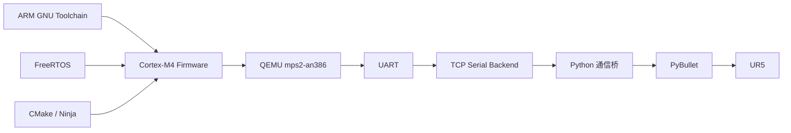
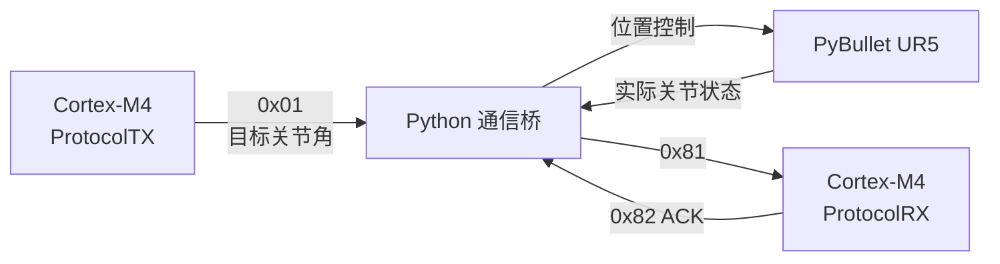

# 第1阶段：环境搭建与通信链路验证报告

## 1. 验证目的

本报告用于记录六轴工业机器人嵌入式运动控制项目第1阶段的开发环境搭建过程，并验证 Cortex-M4 嵌入式控制端、Python 通信桥和 PyBullet / UR5 仿真端之间的数据链路。

本阶段主要验证以下内容：

- ARM Cortex-M4 交叉编译环境能够正常工作；
- QEMU 能够运行 Cortex-M4 固件；
- FreeRTOS 能够完成基础任务调度；
- CMake 能够完成嵌入式工程构建；
- PyBullet 能够加载并控制 UR5 六轴机器人模型；
- Cortex-M4 能够通过 UART 二进制协议向 Python 下发控制指令；
- Python 能够将 UR5 实际关节状态反馈至 Cortex-M4；
- Cortex-M4 能够正确解析状态数据并返回确认信息；
- 整个控制与反馈链路能够形成双向闭环。

---

## 2. 开发与仿真环境

第1阶段使用的主要开发环境如下。

| 类别 | 工具 / 平台 |
|---|---|
| 主机操作系统 | Windows |
| MCU 架构 | ARM Cortex-M4 |
| 交叉编译器 | ARM GNU Toolchain / `arm-none-eabi-gcc` |
| MCU 仿真器 | QEMU |
| QEMU Machine | `mps2-an386` |
| 实时操作系统 | FreeRTOS |
| 构建系统 | CMake + Ninja |
| IDE | Visual Studio Code |
| Python | Python 3.11 |
| 机器人仿真 | PyBullet |
| 机器人模型 | UR5 |
| 通信方式 | QEMU UART + TCP Serial Backend |

整体环境关系如下：



---

## 3. Cortex-M4 开发环境搭建

### 3.1 ARM GNU Toolchain

安装 ARM GNU Toolchain 后，使用：

```powershell
arm-none-eabi-gcc --version
```

确认交叉编译器可以正常调用。

当前工程采用：

```text
-mcpu=cortex-m4
-mthumb
```

生成 ARM Cortex-M4 Thumb 指令集固件。

首先通过裸机 `hello` 工程完成工具链基础验证，随后将 FreeRTOS、UART 和通信协议集成至正式基础工程。

---

### 3.2 QEMU Cortex-M4 仿真

本项目选择 QEMU：

```text
mps2-an386
```

作为 Cortex-M4 仿真平台。

通过：

```powershell
qemu-system-arm -M mps2-an386
```

运行编译生成的 Cortex-M4 ELF 固件。

早期验证中首先通过 UART 标准输出确认：

- Cortex-M4 固件可以被加载；
- 启动文件可以正确进入 `main()`；
- UART 寄存器访问正常；
- QEMU 能够输出 Cortex-M4 程序信息。

在此基础上进一步加入 FreeRTOS 和双向 UART 通信。

---

## 4. FreeRTOS 基础环境验证

工程集成 FreeRTOS Kernel 后，完成以下基础配置：

```text
CPU Clock：25 MHz
Tick Rate：1000 Hz
Preemption：Enabled
Heap：heap_4
```

通过建立多个基础任务，并使用：

```c
vTaskDelay()
```

主动阻塞任务，验证 FreeRTOS 调度器能够在多个 Task 之间进行调度。

随后基础任务逐步替换为实际通信任务：

```text
ProtocolTX
ProtocolRX
```

其中：

- `ProtocolTX` 周期发送六轴目标关节角；
- `ProtocolRX` 周期检查 UART 数据并解析状态帧。

FreeRTOS 基础工程能够正常进入：

```c
vTaskStartScheduler();
```

并持续执行两个通信任务。

---

## 5. CMake 构建环境验证

为了避免完全依赖手工编译命令，第1阶段建立 CMake 交叉编译工程。

ARM 工具链文件位于：

```text
cmake/arm-none-eabi-gcc.cmake
```

CMake 配置命令：

```powershell
cmake -S . -B build/cmake-arm -G Ninja --toolchain cmake/arm-none-eabi-gcc.cmake
```

工程构建命令：

```powershell
cmake --build build/cmake-arm
```

构建过程能够完成：

```text
startup.s
main.c
board.c
protocol.c
memory.c
FreeRTOS Kernel
ARM Cortex-M Port
heap_4
```

等源文件的交叉编译及链接，并生成可供 QEMU 加载的：

```text
freertos_demo.elf
```

### 图 1 CMake 构建成功

> 待补截图：重新执行 `cmake --build build/cmake-arm` 后截取成功终端。

```markdown

```

---

## 6. PyBullet / UR5 仿真环境搭建

### 6.1 PyBullet 环境

Python 端采用 Python 3.11 和 PyBullet 建立机器人仿真环境。

完成以下基础验证：

- PyBullet GUI 启动；
- 地面模型加载；
- UR5 URDF 模型加载；
- Visual Mesh 加载；
- Collision Mesh 加载；
- 六个运动关节识别；
- 关节位置控制；
- 机器人状态读取。

---

### 6.2 UR5 模型

仿真端使用 UR5 六轴工业机器人模型。

主要运动关节为：

```text
shoulder_pan_joint
shoulder_lift_joint
elbow_joint
wrist_1_joint
wrist_2_joint
wrist_3_joint
```

模型成功加载后，可以使用 PyBullet：

```python
p.setJointMotorControlArray(...)
```

控制六个关节运动。

同时使用：

```python
p.getJointState(...)
```

获取机器人实际关节状态。

---

### 6.3 基础场景验证

仿真基础工程进一步实现：

- 地面模型；
- UR5 六轴机器人；
- 基础环境物体；
- 多视角切换。

### 图 2 PyBullet 基础仿真环境

> 待补截图：运行 `scene_demo.py`，截取 UR5、地面、Box 和 Camera View 控件。

```markdown

```

---

## 7. UART 通信链路搭建

### 7.1 通信链路

为了连接 QEMU 中的虚拟 Cortex-M4 和主机上的 Python 程序，将 QEMU UART 后端映射为本地 TCP Server：

```text
127.0.0.1:5555
```

通信结构如下：


需要注意，TCP 仅作为 QEMU UART 在主机端的 Serial Backend。

对于 Cortex-M4 固件而言，数据仍然通过 UART 寄存器进行发送和接收。

---

## 8. 二进制协议验证

通信帧采用以下基本结构：

```text
AA 55 | Command | Length | Payload | Checksum
```

当前六轴关节数据 Payload：

```text
6 × int16
```

每个关节角单位：

```text
0.01°
```

单帧长度：

```text
17 Byte
```

第1阶段主要使用三个命令：

| Command | 方向 | 功能 |
|---|---|---|
| `0x01` | Cortex-M4 → Python | 下发六轴目标角 |
| `0x81` | Python → Cortex-M4 | 上报六轴实际状态 |
| `0x82` | Cortex-M4 → Python | 状态接收确认 |

Checksum 按以下方式计算：

```text
(Command + Length + Payload 所有字节之和) & 0xFF
```

---

## 9. 单向控制链路验证

首先只验证：

```text
Cortex-M4
    ↓
Python
```

Cortex-M4 周期发送第一轴：

```text
10.00°
```

其协议整数表示：

```text
1000 = 0x03E8
```

Python 成功接收到：

```text
RX: aa 55 01 0c e8 03 00 00 ... f8
收到目标角: [10.0, 0.0, 0.0, 0.0, 0.0, 0.0]
```

说明：

- UART TX 正常；
- QEMU TCP Serial Backend 正常；
- Python Socket 接收正常；
- 帧头识别正常；
- Little Endian 解码正常；
- Checksum 校验正常。

---

## 10. 双向通信闭环验证

在单向通信成功后，将 Python 通信模块与 PyBullet UR5 仿真整合。

测试目标角设置为：

```text
Joint 1 = 60.00°
Joint 2 = 0.00°
Joint 3 = 0.00°
Joint 4 = 0.00°
Joint 5 = 0.00°
Joint 6 = 0.00°
```

完整测试链路为：



---

### 10.1 Cortex-M4 → Python

Python 接收到：

```text
RX 0x01 目标角:
[60.0, 0.0, 0.0, 0.0, 0.0, 0.0]
```

说明 Cortex-M4 成功构造并发送目标关节数据帧。

---

### 10.2 Python → PyBullet

Python 将角度由 degree 转换为 rad 后，通过：

```python
p.setJointMotorControlArray(...)
```

控制 UR5。

仿真中第一轴能够运动至目标位置附近。

### 图 3 UR5 第一轴 60° 控制结果

> 待补截图：启动完整通信链路后截取 UR5 已旋转状态。

```markdown

```

---

### 10.3 PyBullet → Cortex-M4

Python 每约：

```text
0.2 s
```

读取一次实际六轴关节状态。

测试过程中得到实际状态，例如：

```text
TX 0x81 实际角度:
[60.0, -3.46, -0.02, -0.07, 0.69, -2.96]
```

Python 将数据打包为：

```text
0x81 JOINT_STATE
```

并通过同一 UART 通信链路返回 Cortex-M4。

---

### 10.4 Cortex-M4 状态解析

Cortex-M4 接收到完整状态帧后依次检查：

```text
Header
Command
Length
Checksum
```

验证通过后解析六轴 `int16` 数据。

为了确认 MCU 确实完成了解析，而不仅仅是 Python 单方面发送成功，MCU 随后返回：

```text
0x82 JOINT_STATE_ACK
```

Python 收到：

```text
RX 0x82 MCU 已确认状态:
[60.0, -3.46, -0.02, -0.07, 0.69, -2.96]
```

反馈值与 Python 发出的状态值一致。

因此可以确认：

```text
Python → Cortex-M4
```

方向的数据传输和协议解析也正常工作。

---

### 图 4 双向通信终端日志

> 待补截图：截取同时包含 `RX 0x01`、`TX 0x81` 和 `RX 0x82` 的终端窗口。

```markdown

```

---

## 11. 闭环验证结果

最终完成的通信路径为：

```text
Cortex-M4 / FreeRTOS
        ↓
0x01 SET_JOINT_TARGETS
        ↓
QEMU UART
        ↓
TCP Serial Backend
        ↓
Python
        ↓
PyBullet / UR5
        ↓
实际关节状态
        ↓
Python
        ↓
0x81 JOINT_STATE
        ↓
QEMU UART
        ↓
Cortex-M4 / FreeRTOS
        ↓
0x82 JOINT_STATE_ACK
        ↓
Python
```

测试结果如下：

| 测试项目 | 结果 |
|---|---|
| ARM Cortex-M4 交叉编译 | 通过 |
| QEMU 固件运行 | 通过 |
| FreeRTOS 任务调度 | 通过 |
| CMake 构建 | 通过 |
| PyBullet GUI | 通过 |
| UR5 模型加载 | 通过 |
| UR5 关节控制 | 通过 |
| MCU → Python 通信 | 通过 |
| Python → MCU 通信 | 通过 |
| Checksum 校验 | 通过 |
| MCU 状态解析 | 通过 |
| ACK 返回 | 通过 |
| UR5 控制与状态反馈闭环 | 通过 |

---

## 12. 环境搭建过程中遇到的问题

### 12.1 中文路径导致 PyBullet 模型加载异常

初始项目路径包含中文字符。

PyBullet 底层 Native 模块在访问：

```text
plane.urdf
```

等资源时出现路径解析异常。

处理方式：

将工程迁移至纯 ASCII 路径：

```text
D:\1_ToGo\Robo\code\six-axis-robot-motion-control
```

迁移后 PyBullet 能够正常加载资源。

---

### 12.2 UR5 URDF 与 Mesh 文件不匹配

初始获取的 UR5 URDF 中 Visual Mesh 引用了：

```text
.dae
```

模型，但对应目录中实际文件类型不匹配。

处理方式：

保留 UR5 URDF，并补充 ROS-Industrial UR5 模型中的：

```text
visual/*.dae
collision/*.stl
```

资源。

完成后 UR5 能够正确显示 Visual Mesh 和 Collision Mesh。

---

### 12.3 PyBullet 安装问题

当前 Python 环境无法直接获得匹配的预编译 PyBullet Wheel。

处理方式：

安装 Microsoft C++ Build Tools 后，在本地完成 PyBullet Native Extension 构建。

随后 PyBullet GUI 能够正常启动。

---

### 12.4 VS Code 未识别新安装的 CMake

安装 CMake 后，外部终端可以正确调用：

```powershell
cmake --version
```

但已经打开的 VS Code 未继承更新后的 PATH。

处理方式：

关闭 VS Code，并从已经更新环境变量的终端重新启动。

随后 VS Code 可以正常调用 CMake。

---

### 12.5 CMake Toolchain 参数解析问题

最初使用：

```text
-DCMAKE_TOOLCHAIN_FILE=...
```

时出现 Toolchain 文件路径解析异常。

最终改用：

```powershell
--toolchain cmake/arm-none-eabi-gcc.cmake
```

完成交叉编译配置。

---

## 13. 回归验证

在后续增加：

```text
CMake
Board Clock
GPIO 初始化模板
UART RX
UART TX
双向协议
```

后，再次运行完整机器人控制链路。

测试结果仍能够正常观察到：

```text
RX 0x01
TX 0x81
RX 0x82
```

同时 UR5 第一轴能够继续响应 `60°` 目标角。

说明新加入的工程模块没有破坏已经建立的 Cortex-M4 → Python → PyBullet 双向通信链路。

---

## 14. 当前限制

当前第1阶段主要目标为建立最小可运行系统，因此仍存在以下限制。

UART 接收当前采用：

```text
1 ms轮询
```

而不是中断方式。

当前协议解析主要针对固定：

```text
17 Byte
```

关节数据帧。

当前 Checksum 为简单8位累加校验，后续可升级为 CRC。

当前关节数据采用：

```text
int16 × 0.01°
```

可表示范围约为：

```text
-327.68° ~ +327.67°
```

对于部分机器人关节范围需要在后续协议设计中重新评估。

此外，当前 PyBullet 使用自身 `POSITION_CONTROL` 完成基础运动验证，正式 PID 控制算法尚未在 Cortex-M4 端实现。

---

## 15. 验证结论

第1阶段已经成功建立 Cortex-M4 嵌入式控制端、FreeRTOS、QEMU、Python 和 PyBullet / UR5 之间的完整开发与仿真验证环境。

测试结果证明：

```text
Cortex-M4 → Python → PyBullet / UR5
```

控制指令链路能够正常工作，同时：

```text
PyBullet / UR5 → Python → Cortex-M4
```

状态反馈链路也能够正常工作。

Cortex-M4 在收到状态信息后能够完成协议解析、Checksum 校验并返回 ACK，因此当前系统已经形成可验证的双向通信闭环。

该环境可以作为后续 UART / Timer / GPIO 驱动标准化、协议解析、电机驱动抽象、运动学求解、轨迹规划以及 PID 闭环控制开发的基础验证平台。