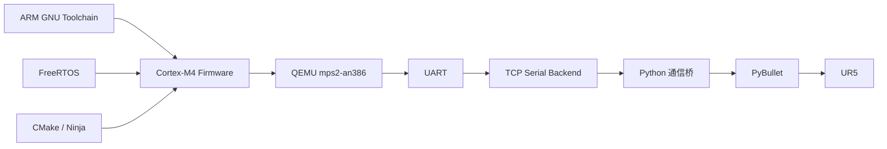
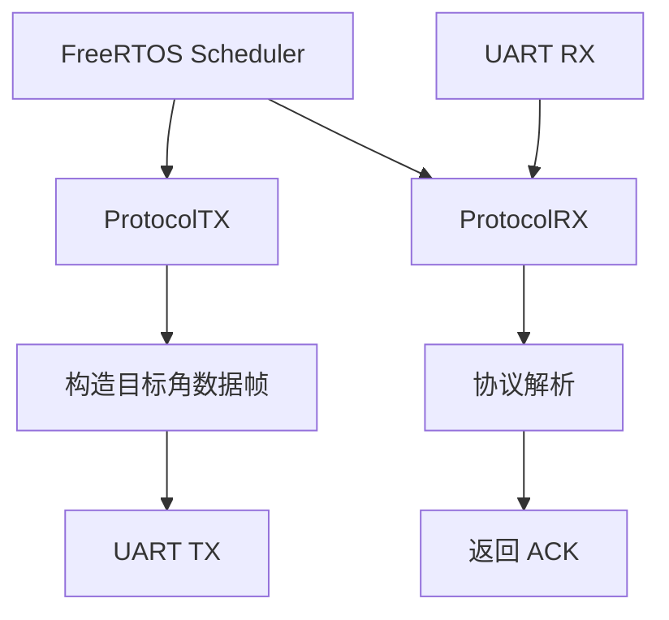
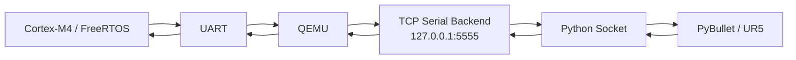
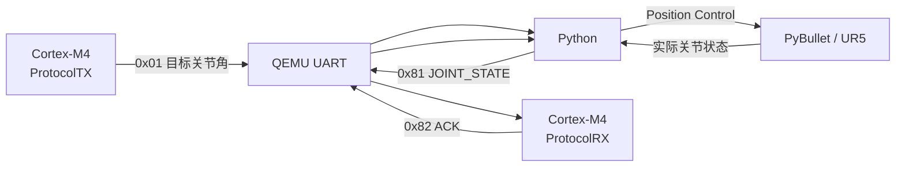

# 第1阶段：环境搭建与通信链路验证报告

## 1. 验证目的

本报告用于验证六轴工业机器人嵌入式运动控制项目第1阶段所搭建的开发环境与通信链路。

本阶段验证对象包括：

- ARM Cortex-M4 交叉编译环境；
- QEMU Cortex-M4 仿真环境；
- FreeRTOS 基础运行环境；
- CMake 嵌入式构建系统；
- PyBullet / UR5 机器人仿真环境；
- Cortex-M4 与 Python 之间的 UART 二进制通信；
- Python 与 PyBullet 之间的机器人控制接口；
- 机器人状态由 PyBullet 返回 Cortex-M4 的反馈链路；
- Cortex-M4 对状态数据的解析与确认。

验证目标是建立一条完整的：

```text
控制指令下发
→ 机器人执行
→ 状态反馈
→ MCU解析确认
```

双向数据链路，为后续外设驱动、运动学、轨迹规划和闭环控制算法开发提供基础验证平台。

---

## 2. 开发环境

第1阶段采用的主要开发与仿真环境如下。

| 类别 | 配置 |
|---|---|
| 主机系统 | Windows |
| MCU 架构 | ARM Cortex-M4 |
| 交叉编译器 | ARM GNU Toolchain / `arm-none-eabi-gcc` |
| MCU 仿真平台 | QEMU `mps2-an386` |
| 实时操作系统 | FreeRTOS |
| 构建系统 | CMake + Ninja |
| 开发环境 | Visual Studio Code |
| Python 环境 | Python 3.11 |
| 机器人仿真平台 | PyBullet |
| 机器人模型 | UR5 |
| 固件通信接口 | UART |
| QEMU 主机侧串口后端 | TCP `127.0.0.1:5555` |

整体开发环境关系如下：



---

## 3. Cortex-M4 与 QEMU 环境验证

### 3.1 交叉编译验证

嵌入式程序使用：

```text
arm-none-eabi-gcc
```

进行 ARM Cortex-M4 交叉编译。

主要目标架构参数为：

```text
-mcpu=cortex-m4
-mthumb
```

项目首先建立 Cortex-M4 裸机最小程序，用于验证：

- 编译器可正常生成 ARM ELF；
- 启动文件能够正确进入 `main()`；
- 链接脚本能够正确组织代码与数据段；
- QEMU 能够加载编译生成的固件；
- UART 输出能够正常工作。

完成基础验证后，在该工程基础上集成 FreeRTOS。

---

### 3.2 QEMU 仿真平台

本阶段采用：

```text
QEMU machine: mps2-an386
```

用于模拟 ARM Cortex-M4 运行环境。

固件以：

```text
freertos_demo.elf
```

形式加载至 QEMU。

QEMU 提供 UART 外设模型，使 Cortex-M4 固件可以按照实际嵌入式程序的方式访问 UART 寄存器。

因此 Python 并不直接访问 Cortex-M4 程序内部变量，而是通过 QEMU 暴露出的 UART 通信链路与固件交互。

---

## 4. FreeRTOS 运行验证

FreeRTOS 集成后，系统采用抢占式任务调度。

当前主要配置为：

```text
CPU Clock：25 MHz
Tick Rate：1000 Hz
Tick Period：1 ms
Heap：heap_4
```

基础阶段首先通过多个测试任务验证：

```text
任务创建
任务切换
vTaskDelay()
```

能够正常运行。

随后测试任务替换为两个实际通信任务：

```text
ProtocolTX
ProtocolRX
```

其职责分别为：

| 任务 | 功能 |
|---|---|
| `ProtocolTX` | 周期发送机器人目标关节角 |
| `ProtocolRX` | 接收并解析机器人状态数据 |

任务关系如下：



其中：

```text
ProtocolTX：1000 ms 周期
ProtocolRX：1 ms 周期检查
```

验证结果表明 FreeRTOS 能够同时维持周期发送和接收处理任务。

---

## 5. CMake 构建验证

项目建立统一 CMake 交叉编译系统。

ARM Toolchain 文件位于：

```text
cmake/arm-none-eabi-gcc.cmake
```

工程配置命令为：

```powershell
cmake -S . -B build/cmake-arm -G Ninja --toolchain cmake/arm-none-eabi-gcc.cmake
```

构建命令：

```powershell
cmake --build build/cmake-arm
```

CMake 构建过程中包含：

```text
startup.s
main.c
board.c
protocol.c
memory.c
FreeRTOS Kernel
Cortex-M Port
heap_4.c
```

最终生成 Cortex-M4 可执行文件：

```text
freertos_demo.elf
```

构建完成后，该 ELF 文件能够继续在 QEMU 中正常运行。

---

## 6. PyBullet / UR5 仿真环境验证

### 6.1 仿真环境组成

机器人仿真端采用 PyBullet。

仿真场景包括：

```text
地面 Plane
UR5 六轴机器人
基础环境物体
```

UR5 采用 URDF 描述机器人结构，并加载对应：

```text
Visual Mesh
Collision Mesh
```

完成机器人外观及碰撞模型构建。

---

### 6.2 六轴关节识别

当前控制的六个 UR5 运动关节分别为：

```text
shoulder_pan_joint
shoulder_lift_joint
elbow_joint
wrist_1_joint
wrist_2_joint
wrist_3_joint
```

Python 启动后读取机器人 Joint 信息，并建立：

```text
joint name → joint index
```

映射。

该映射用于后续六轴控制与状态采集。

---

### 6.3 基础运动控制

机器人关节控制采用 PyBullet：

```python
p.setJointMotorControlArray(...)
```

使用：

```text
POSITION_CONTROL
```

模式控制六轴目标位置。

同时通过：

```python
p.getJointState(...)
```

读取当前关节实际位置。

此外基础仿真工程已经实现：

- 单关节控制演示；
- 环境物体加载；
- 多视角切换。

---

## 7. 通信链路结构

嵌入式端和机器人仿真端之间的完整通信路径如下：



需要特别说明：

```text
TCP 并不是嵌入式通信协议本身。
```

在 Cortex-M4 一侧仍然按照 UART 外设进行发送和接收。

TCP 仅作为：

```text
QEMU UART → 主机 Python
```

之间的数据承载方式。

---

## 8. 二进制通信协议

当前通信帧格式为：

```text
AA 55 | Command | Length | Payload | Checksum
```

其字段定义如下：

| 字段 | 长度 |
|---|---:|
| Header | 2 Byte |
| Command | 1 Byte |
| Length | 1 Byte |
| Payload | 12 Byte |
| Checksum | 1 Byte |

完整帧长度：

```text
17 Byte
```

Payload 包含六轴关节数据：

```text
6 × signed int16
```

关节角单位定义为：

```text
0.01°
```

例如：

```text
60.00° = 6000
10.00° = 1000
-20.00° = -2000
```

多字节数据采用：

```text
Little Endian
```

---

## 9. 通信指令定义

当前阶段使用三个 Command：

| Command | 名称 | 方向 | 功能 |
|---|---|---|---|
| `0x01` | `SET_JOINT_TARGETS` | MCU → Python | 六轴目标关节角 |
| `0x81` | `JOINT_STATE` | Python → MCU | 六轴实际关节状态 |
| `0x82` | `JOINT_STATE_ACK` | MCU → Python | MCU状态接收确认 |

Checksum 计算范围为：

```text
Command + Length + Payload
```

计算方法：

```text
Checksum =
    (参与校验的所有字节之和) & 0xFF
```

---

## 10. MCU → Python 通信验证

首先验证 Cortex-M4 到 Python 的单向通信。

测试数据：

```text
Joint 1 = 10.00°
Joint 2~6 = 0°
```

协议中：

```text
10.00° = 1000
```

对应十六进制：

```text
0x03E8
```

Little Endian 字节排列：

```text
E8 03
```

实际 Python 端接收到：

```text
RX:
aa 55 01 0c e8 03 00 00 ... f8
```

解析结果：

```text
收到目标角:
[10.0, 0.0, 0.0, 0.0, 0.0, 0.0]
```

由此验证以下模块工作正常：

```text
MCU协议打包
UART发送
QEMU串口后端
TCP传输
Python帧同步
Little Endian解析
Checksum校验
```

---

## 11. 完整机器人控制验证

在单向通信验证通过后，将 UART 通信模块与 PyBullet 仿真控制模块组合。

测试目标改为：

```text
Joint 1 = 60.00°
Joint 2 = 0.00°
Joint 3 = 0.00°
Joint 4 = 0.00°
Joint 5 = 0.00°
Joint 6 = 0.00°
```

Python 接收到：

```text
RX 0x01 目标角:
[60.0, 0.0, 0.0, 0.0, 0.0, 0.0]
```

Python 将目标角转换为 rad 后传递给 PyBullet。

UR5 第一轴能够按照控制指令运动至约：

```text
60°
```

说明：

```text
Cortex-M4
→ UART
→ Python
→ PyBullet
→ UR5
```

控制链路工作正常。

---

## 12. Python → MCU 状态反馈验证

机器人运动过程中，Python 周期读取六个实际关节位置。

状态采样周期：

```text
0.2 s
```

即约：

```text
5 Hz
```

典型状态数据为：

```text
TX 0x81 实际角度:
[60.0, -3.46, -0.02, -0.07, 0.69, -2.96]
```

Python 将六轴状态打包为：

```text
0x81 JOINT_STATE
```

并通过：

```text
Python Socket
→ TCP
→ QEMU UART
→ Cortex-M4
```

发送至 MCU。

---

## 13. MCU 状态解析与 ACK 验证

Cortex-M4 接收到状态数据后执行以下检查：

```text
帧头检查
    ↓
Command检查
    ↓
Payload Length检查
    ↓
Checksum检查
    ↓
六轴状态解析
```

数据验证正确后，MCU 使用：

```text
0x82 JOINT_STATE_ACK
```

将解析出的六轴状态重新发送至 Python。

Python 实际收到：

```text
RX 0x82 MCU 已确认状态:
[60.0, -3.46, -0.02, -0.07, 0.69, -2.96]
```

ACK 中的数据与 Python 原始发送状态一致。

因此不仅能够证明：

```text
Python成功发送状态
```

还能够进一步证明：

```text
Cortex-M4已经实际接收、校验并解析状态数据
```

---

## 14. 双向闭环验证

最终完整数据路径如下：



验证过程中能够同时观察到：

```text
RX 0x01 目标角:
[60.0, 0.0, 0.0, 0.0, 0.0, 0.0]

TX 0x81 实际角度:
[60.0, -3.46, -0.02, -0.07, 0.69, -2.96]

RX 0x82 MCU 已确认状态:
[60.0, -3.46, -0.02, -0.07, 0.69, -2.96]
```

由此确认：

```text
控制命令下发
机器人执行
状态采集
状态上传
MCU协议解析
MCU确认返回
```

全部能够正常完成。

---

## 15. 回归验证

在完成通信链路后，工程进一步加入：

```text
CMake构建系统
Board Clock初始化
GPIO初始化模板
```

完成上述修改后，再次运行完整系统进行回归验证。

验证结果：

- Cortex-M4 固件正常启动；
- FreeRTOS 两个通信任务正常运行；
- Python能够继续接收 `0x01`；
- UR5仍能够执行 60° 目标；
- Python能够继续发送 `0x81`；
- MCU能够继续返回 `0x82`。

说明后续工程结构调整没有破坏已经建立的通信与仿真链路。

---

## 16. 测试结果汇总

| 测试项目 | 测试结果 |
|---|---|
| ARM Cortex-M4 交叉编译 | 通过 |
| Cortex-M4 裸机启动 | 通过 |
| QEMU `mps2-an386` 固件运行 | 通过 |
| UART 基础发送 | 通过 |
| FreeRTOS 任务创建 | 通过 |
| FreeRTOS 任务调度 | 通过 |
| `vTaskDelay()` 延时 | 通过 |
| CMake Configure | 通过 |
| CMake Build | 通过 |
| PyBullet GUI | 通过 |
| UR5 URDF 加载 | 通过 |
| Visual Mesh 加载 | 通过 |
| Collision Mesh 加载 | 通过 |
| 单关节控制 | 通过 |
| 环境物体加载 | 通过 |
| 仿真视角切换 | 通过 |
| MCU → Python 数据传输 | 通过 |
| Python协议解析 | 通过 |
| Checksum校验 | 通过 |
| Python → MCU 数据传输 | 通过 |
| MCU状态解析 | 通过 |
| MCU ACK返回 | 通过 |
| UR5 60° 控制测试 | 通过 |
| 双向控制与状态反馈链路 | 通过 |
| BSP加入后的系统回归测试 | 通过 |

---

## 17. 当前验证边界

本阶段主要目标是建立最小可运行开发与仿真链路，因此当前系统仍存在以下边界。

### 17.1 UART接收方式

当前 Cortex-M4 采用：

```text
1 ms周期轮询
```

读取 UART。

后续阶段计划进一步实现 UART 中断和接收缓存。

### 17.2 协议解析

当前主要处理固定：

```text
17 Byte
```

六轴关节数据帧。

后续需要建立更完整的字节流状态机和消息分发机制。

### 17.3 数据校验

当前采用简单8位累加 Checksum。

后续可根据通信可靠性要求升级为 CRC。

### 17.4 关节数据范围

当前协议采用：

```text
signed int16 × 0.01°
```

表示范围约为：

```text
-327.68° ~ +327.67°
```

后续需要根据实际机器人关节范围重新确认数据位宽或分辨率设计。

### 17.5 控制算法

当前机器人执行部分采用 PyBullet 内置：

```text
POSITION_CONTROL
```

验证通信和基础运动。

本阶段尚未实现：

```text
正运动学
逆运动学
轨迹规划
Cortex-M4 PID位置闭环
```

上述模块将在后续阶段逐步实现。

---

## 18. 验证结论

第1阶段已经完成六轴工业机器人嵌入式运动控制项目所需的基础开发和仿真环境搭建。

当前已经建立：

```text
ARM Cortex-M4
+ FreeRTOS
+ QEMU
+ CMake
+ UART二进制协议
+ Python通信桥
+ PyBullet
+ UR5
```

组成的完整基础验证平台。

测试结果表明，Cortex-M4 能够通过 UART 向 Python 下发机器人目标关节角，Python 能够控制 PyBullet 中的 UR5 完成相应运动。

同时，Python 能够读取机器人实际关节状态并返回 Cortex-M4，Cortex-M4 能够完成状态数据校验和解析，并通过 ACK 将处理结果返回 Python。

因此，第1阶段已经完成：

```text
控制指令下发
→ 仿真机器人执行
→ 实际状态反馈
→ MCU数据解析
→ 接收确认
```

的双向通信闭环验证。

当前开发环境和基础通信链路可作为后续外设驱动标准化、电机控制抽象、运动学求解、轨迹规划及 PID 闭环控制开发的基础平台。
