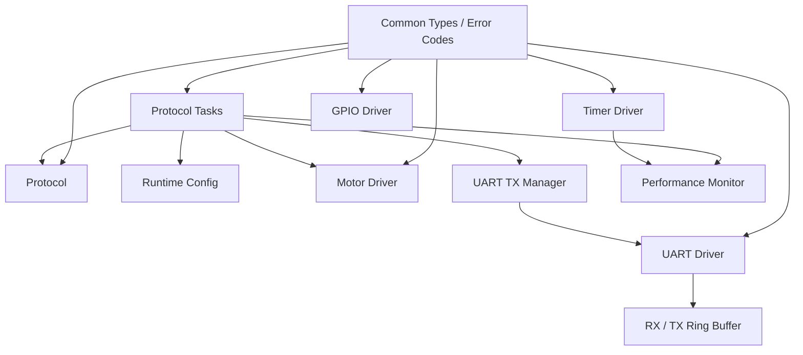

# 第2阶段：驱动接口规范与模块说明文档

## 1. 文档目的

本文档用于说明六轴工业机器人嵌入式运动控制项目第2阶段完成的外设驱动、通信模块及关节电机驱动抽象层。

第2阶段主要完成：

- UART 中断收发驱动；
- Timer 驱动；
- GPIO 输出驱动；
- UART Ring Buffer；
- 通信协议解析；
- 参数配置与状态查询；
- 六轴关节电机驱动抽象；
- UART 多任务发送管理；
- 运行时参数管理；
- 性能监测接口。

本文档主要明确：

- 各模块职责；
- Driver API 规范；
- 输入输出数据类型；
- 统一错误返回值；
- 模块调用关系；
- QEMU 仿真平台下的实现边界。

---

## 2. 软件模块结构

当前第2阶段相关代码主要位于：

```text
firmware/freertos_demo/
├── common/
│   ├── robot_types.h
│   └── error_code.h
│
├── drivers/
│   ├── uart_driver.c
│   ├── uart_driver.h
│   ├── timer_driver.c
│   ├── timer_driver.h
│   ├── gpio_driver.c
│   ├── gpio_driver.h
│   ├── motor_driver.c
│   └── motor_driver.h
│
├── communications/
│   ├── protocol.c
│   ├── protocol.h
│   ├── ring_buffer.c
│   └── ring_buffer.h
│
├── application/
│   ├── protocol_tasks.c
│   ├── protocol_tasks.h
│   ├── uart_tx_manager.c
│   ├── uart_tx_manager.h
│   ├── runtime_config.c
│   └── runtime_config.h
│
└── diagnostics/
    ├── performance_monitor.c
    └── performance_monitor.h
```

模块关系如下：



各层遵循：

```text
Application
    ↓
Communication / Driver API
    ↓
Hardware / QEMU
```

上层模块不直接访问底层 UART、Timer 或 GPIO 寄存器。

---

## 3. 公共数据类型与错误码

### 3.1 六轴关节数据

机器人关节数量统一定义为：

```text
ROBOT_JOINT_COUNT = 6
```

普通关节角使用：

```c
robot_joint_angle_t
```

底层类型：

```text
int16_t
```

单位：

```text
0.01 degree
```

Canonical Angle 范围：

```text
[-180°, 180°)
```

例如：

```text
+60.00° → 6000
-90.00° → -9000
+180.00° → -18000
```

连续关节位置使用：

```c
robot_joint_position_t
```

底层类型：

```text
int32_t
```

用于保存经过 Angle Wrap Correction 后的累计连续位置。

关节速度使用：

```c
robot_joint_velocity_t
```

单位：

```text
degree / second
```

---

### 3.2 统一错误码

各 Driver 和 Application 模块统一使用：

```c
robot_status_t
```

主要状态码如下：

| 状态码 | 含义 |
|---|---|
| `ROBOT_STATUS_OK` | 操作成功 |
| `ROBOT_STATUS_ERROR_NULL_POINTER` | 空指针 |
| `ROBOT_STATUS_ERROR_INVALID_ARGUMENT` | 参数非法 |
| `ROBOT_STATUS_ERROR_INVALID_COMMAND` | Command 非法 |
| `ROBOT_STATUS_ERROR_INVALID_LENGTH` | 数据长度非法 |
| `ROBOT_STATUS_ERROR_CHECKSUM` | Checksum 错误 |
| `ROBOT_STATUS_ERROR_BUFFER_FULL` | 软件缓冲区已满 |
| `ROBOT_STATUS_ERROR_NOT_READY` | 模块尚未准备完成 |
| `ROBOT_STATUS_ERROR_INTERNAL` | 内部错误 |
| `ROBOT_STATUS_ERROR_OUT_OF_RANGE` | 参数超出有效范围 |

接口原则为：

```text
成功 → ROBOT_STATUS_OK
失败 → 明确的负错误码
```

避免使用不同模块各自定义互不兼容的返回值。

---

## 4. UART Driver

### 4.1 模块职责

UART Driver 位于：

```text
drivers/uart_driver.c
```

主要负责：

- UART0 初始化；
- UART RX Interrupt；
- UART TX Interrupt；
- RX Ring Buffer；
- TX Ring Buffer；
- RX Drop 统计；
- RX Event Callback；
- UART 发送状态管理。

当前 QEMU 平台使用：

```text
CMSDK APB UART0
Base Address: 0x40004000
```

中断映射：

```text
IRQ0 → UART0 RX
IRQ1 → UART0 TX
```

---

### 4.2 初始化接口

```c
robot_status_t uart_driver_init(void);
```

初始化内容包括：

- UART 寄存器；
- RX Ring Buffer；
- TX Ring Buffer；
- Interrupt 状态；
- RX Drop Counter；
- TX Busy 状态。

正常返回：

```text
ROBOT_STATUS_OK
```

---

### 4.3 RX Interrupt

开启接收中断：

```c
robot_status_t uart_driver_enable_rx_interrupt(void);
```

注册 RX 事件回调：

```c
void uart_driver_set_rx_event_callback(
    uart_driver_rx_event_callback_t callback
);
```

接收路径：

```text
UART0 RX IRQ
    ↓
UART0_RX_IRQHandler()
    ↓
读取 UART DATA
    ↓
RX Ring Buffer
    ↓
RX Event Callback
    ↓
ProtocolRX Task
```

从 RX Buffer 读取数据：

```c
uint8_t uart_driver_read_byte(
    uint8_t *data
);
```

返回：

```text
1 → 成功读取一个 Byte
0 → 当前无数据或参数无效
```

---

### 4.4 TX Interrupt

发送接口：

```c
robot_status_t uart_driver_write(
    const uint8_t *data,
    uint32_t length
);
```

该接口不采用逐字节阻塞发送。

数据首先进入：

```text
TX Ring Buffer
```

随后由：

```text
UART0_TX_IRQHandler()
```

异步发送。

发送路径：

```text
Application
    ↓
uart_driver_write()
    ↓
TX Ring Buffer
    ↓
UART TX IRQ
    ↓
UART DATA Register
```

当 TX Ring Buffer 完全发送完毕后：

```text
TX Interrupt Disable
TX Busy = 0
```

查询接口：

```c
uint8_t uart_driver_is_tx_busy(void);
```

---

### 4.5 RX Drop Counter

当 RX Ring Buffer 已满时，新收到的数据不能写入 Buffer。

Driver 对丢弃 Byte 进行累计：

```c
uint32_t uart_driver_get_rx_drop_count(void);
```

该指标用于：

- Diagnostics；
- Burst Test；
- Soak Test；
- 通信异常分析。

---

## 5. Ring Buffer

Ring Buffer 位于：

```text
communications/ring_buffer.c
```

采用 Single Producer / Single Consumer 设计。

接口包括：

```c
void ring_buffer_init(
    ring_buffer_t *ring_buffer
);

uint8_t ring_buffer_write(
    ring_buffer_t *ring_buffer,
    uint8_t data
);

uint8_t ring_buffer_read(
    ring_buffer_t *ring_buffer,
    uint8_t *data
);

uint8_t ring_buffer_is_empty(
    const ring_buffer_t *ring_buffer
);

uint8_t ring_buffer_is_full(
    const ring_buffer_t *ring_buffer
);
```

物理容量：

```text
128 Byte
```

由于使用：

```text
head == tail
```

表示 Empty，因此实际有效容量：

```text
127 Byte
```

UART RX 使用方式：

```text
Producer → UART RX ISR
Consumer → ProtocolRX Task
```

UART TX 使用方式：

```text
Producer → UART Driver Write
Consumer → UART TX ISR
```

---

## 6. Timer Driver

### 6.1 模块职责

Timer Driver 使用 QEMU MPS2-AN386 的 CMSDK APB Timer。

当前分工：

```text
Timer0 → Free-running Performance Counter
Timer1 → Periodic Interrupt
```

初始化接口：

```c
void timer_driver_init(void);
```

---

### 6.2 Timer0 性能计时

主要接口：

```c
uint32_t timer_driver_get_counter(void);

uint32_t timer_driver_elapsed_ticks(
    uint32_t start_counter,
    uint32_t end_counter
);

uint32_t timer_driver_get_frequency_hz(void);
```

当前 Timer 输入时钟：

```text
25 MHz
```

因此：

```text
1 Tick = 40 ns
```

Timer0 当前主要用于：

- Protocol Parser Benchmark；
- UART ISR → Task Wake-up Latency；
- 后续实时控制性能测量。

---

### 6.3 Timer1 周期中断

启动：

```c
robot_status_t timer_driver_start_periodic(
    uint32_t frequency_hz,
    timer_driver_periodic_callback_t callback
);
```

停止：

```c
void timer_driver_stop_periodic(void);
```

状态接口：

```c
uint32_t timer_driver_get_periodic_frequency_hz(void);

uint32_t timer_driver_get_periodic_irq_count(void);

uint8_t timer_driver_is_periodic_running(void);
```

当前基础配置：

```text
100 Hz
```

即：

```text
10 ms Period
```

Callback 在 ISR Context 中执行，因此必须：

- 保持短小；
- 不执行阻塞操作；
- FreeRTOS API 必须使用 FromISR 版本。

---

## 7. GPIO Driver

### 7.1 模块职责

GPIO Driver 提供统一 GPIO 输出接口。

当前支持：

```text
32 Pins
```

电平类型：

```c
GPIO_DRIVER_LEVEL_LOW
GPIO_DRIVER_LEVEL_HIGH
```

主要接口：

```c
robot_status_t gpio_driver_init(void);

robot_status_t gpio_driver_configure_output(
    uint8_t pin
);

robot_status_t gpio_driver_write(
    uint8_t pin,
    gpio_driver_level_t level
);

robot_status_t gpio_driver_toggle(
    uint8_t pin
);

robot_status_t gpio_driver_get_output_level(
    uint8_t pin,
    gpio_driver_level_t *level
);
```

---

### 7.2 QEMU Backend

当前项目使用：

```text
QEMU mps2-an386
```

该环境没有提供项目所需 GPIO Block 的实际模拟行为。

因此当前默认采用：

```text
Shadow Backend
```

Driver 在软件中保存：

- Output Enable；
- Output Level。

通过：

```c
uint8_t gpio_driver_is_mmio_backend(void);
```

可查询当前是否使用真实 MMIO Backend。

该设计使上层接口保持稳定。

未来迁移实际 MCU 时，只需替换 Driver Backend，不需要修改上层 Application。

---

## 8. Motor Driver

### 8.1 模块职责

Motor Driver 是六轴机器人关节驱动抽象层。

当前属于：

```text
Simulation Backend
```

目标位置由 Cortex-M4 软件维护，位置反馈主要来自 Python / PyBullet。

上层模块统一通过 Motor Driver API 操作机器人状态，而不直接依赖 PyBullet 或未来真实 Servo Driver。

---

### 8.2 Target Position

初始化：

```c
robot_status_t motor_driver_init(void);
```

设置目标：

```c
robot_status_t motor_driver_set_target_positions(
    const robot_joint_angles_t *targets
);
```

读取目标：

```c
robot_status_t motor_driver_get_target_positions(
    robot_joint_angles_t *targets
);
```

输入角度统一规范化至：

```text
[-180°, 180°)
```

---

### 8.3 Feedback

更新位置反馈：

```c
robot_status_t motor_driver_update_feedback(
    const robot_joint_angles_t *feedback,
    robot_real_t delta_time_s
);
```

Driver 会：

```text
Canonical Angle Normalize
        ↓
Angle Wrap Correction
        ↓
Continuous Position
        ↓
Velocity Calculation
```

例如：

```text
+179° → -179°
```

实际连续运动被识别为：

```text
+179° → +181°
```

而不是：

```text
+179° → -179°
```

产生的错误跳变。

---

### 8.4 Feedback 查询

普通 Canonical Position：

```c
robot_status_t motor_driver_get_positions(
    robot_joint_angles_t *positions
);
```

连续位置：

```c
robot_status_t motor_driver_get_unwrapped_positions(
    robot_joint_positions_t *positions
);
```

速度：

```c
robot_status_t motor_driver_get_velocities(
    robot_joint_velocities_t *velocities
);
```

Feedback 状态：

```c
uint8_t motor_driver_has_feedback(void);
```

该统一接口为后续：

```text
Kinematics
Trajectory Planning
PID Control
```

提供机器人状态输入。

---

## 9. Communication Protocol

### 9.1 通用帧格式

当前协议格式：

```text
AA 55 | Command | Length | Payload | Checksum
```

字段：

| 字段 | 长度 |
|---|---:|
| Header | 2 Byte |
| Command | 1 Byte |
| Length | 1 Byte |
| Payload | 0 ~ 64 Byte |
| Checksum | 1 Byte |

最大 Payload：

```text
64 Byte
```

Checksum 范围：

```text
Command + Length + Payload
```

采用：

```text
8 bit additive checksum
```

---

### 9.2 Parser

Protocol Parser 使用字节流状态机：

```text
WAIT_HEADER_0
    ↓
WAIT_HEADER_1
    ↓
READ_COMMAND
    ↓
READ_LENGTH
    ↓
READ_PAYLOAD
    ↓
READ_CHECKSUM
```

主要接口：

```c
void protocol_parser_init(
    protocol_parser_t *parser
);

uint8_t protocol_parser_process_byte(
    protocol_parser_t *parser,
    uint8_t byte,
    protocol_frame_t *output_frame
);
```

Parser 支持：

- 可变长度 Payload；
- Checksum 校验；
- 长度检查；
- 错误数据丢弃；
- 后续合法数据重新同步。

---

### 9.3 Command

当前协议主要 Command：

| Command | 名称 | 功能 |
|---:|---|---|
| `0x01` | `SET_JOINT_TARGETS` | 设置六轴目标位置 |
| `0x02` | `SET_PARAMETER` | 修改运行时参数 |
| `0x81` | `JOINT_STATE` | 上传六轴状态 |
| `0x82` | `JOINT_STATE_ACK` | 状态接收确认 |
| `0x83` | `GET_DIAGNOSTICS` | 查询诊断数据 |
| `0x84` | `DIAGNOSTICS_RESPONSE` | 返回诊断数据 |
| `0x85` | `PARAMETER_ACK` | 参数配置结果 |

多字节数值统一采用：

```text
Little Endian
```

---

## 10. Runtime Configuration

运行时参数模块位于：

```text
application/runtime_config.c
```

当前支持：

```text
ProtocolTX Period
```

初始化：

```c
robot_status_t runtime_config_init(void);
```

设置：

```c
robot_status_t runtime_config_set_protocol_tx_period_ms(
    uint32_t period_ms
);
```

读取：

```c
uint32_t runtime_config_get_protocol_tx_period_ms(void);
```

有效范围：

```text
1 ~ 60000 ms
```

模块职责划分为：

```text
Protocol
→ 负责 Wire Format

Protocol Tasks
→ 负责 Command Dispatch

Runtime Config
→ 负责参数范围与当前生效值
```

避免将运行时业务参数直接保存在通信协议模块内部。

---

## 11. UART TX Manager

UART Driver 本身不依赖 FreeRTOS。

但系统中存在多个可能发送 UART Frame 的 Task。

因此 Application 层增加：

```text
uart_tx_manager.c
```

主要接口：

```c
robot_status_t uart_tx_manager_init(void);

robot_status_t uart_tx_manager_send_frame(
    const uint8_t *data,
    uint32_t length
);
```

该模块使用 FreeRTOS Mutex 对 Task 级发送请求进行串行化。

结构：

```text
ProtocolTX Task ─┐
                 │
ProtocolRX Task ─┼→ UART TX Manager
                 │       ↓
Diagnostics ─────┘   FreeRTOS Mutex
                         ↓
                    UART Driver
                         ↓
                    TX Ring Buffer
                         ↓
                    UART TX IRQ
```

因此：

```text
UART Driver
```

保持与 RTOS 解耦，而：

```text
UART TX Manager
```

负责多 Task 并发协调。

---

## 12. Protocol Application Tasks

当前通信 Application 通过：

```c
robot_status_t protocol_tasks_start(void);
```

启动主要通信任务。

当前包含：

```text
ProtocolTX Task
ProtocolRX Task
```

RX 已由第1阶段的轮询方式升级为：

```text
UART RX IRQ
    ↓
RX Callback
    ↓
FreeRTOS Task Notification
    ↓
ProtocolRX Task
```

因此 ProtocolRX Task 在没有数据时可以阻塞等待，而不需要持续 1 ms 轮询 UART。

收到完整 Frame 后，根据 Command 分发至：

```text
Motor Driver
Runtime Config
Diagnostics
```

等模块。

---

## 13. Performance Monitor

性能监测模块位于：

```text
diagnostics/performance_monitor.c
```

当前主要记录：

1. Protocol Parser 执行时间；
2. UART RX ISR → ProtocolRX Task 唤醒时间。

主要接口：

```c
void performance_monitor_init(void);

robot_status_t performance_monitor_run_parser_benchmark(
    uint32_t sample_count
);

void performance_monitor_arm_task_wakeup(void);

void performance_monitor_mark_rx_isr(void);

void performance_monitor_record_task_wakeup(void);

robot_status_t performance_monitor_get_metrics(
    performance_metrics_t *metrics
);
```

统计指标包括：

```text
Sample Count
Minimum Tick
Average Tick
Maximum Tick
```

时间基准来自：

```text
Timer0
25 MHz
```

---

## 14. 模块调用关系

当前主要数据路径如下。

### 14.1 Host → MCU

```text
Python
    ↓
QEMU UART
    ↓
UART RX IRQ
    ↓
RX Ring Buffer
    ↓
ProtocolRX Task
    ↓
Protocol Parser
    ↓
Command Dispatch
    ↓
Motor Driver / Runtime Config / Diagnostics
```

---

### 14.2 MCU → Host

```text
ProtocolTX / ProtocolRX
    ↓
Protocol Frame Builder
    ↓
UART TX Manager
    ↓
UART Driver
    ↓
TX Ring Buffer
    ↓
UART TX IRQ
    ↓
QEMU UART
    ↓
Python
```

---

### 14.3 Motor Feedback

```text
Python / PyBullet
    ↓
JOINT_STATE
    ↓
ProtocolRX
    ↓
Motor Driver
    ↓
Canonical Position
Continuous Position
Velocity
    ↓
Algorithm / Control
```

这样能够将：

```text
Hardware / Communication
```

与：

```text
Robot Algorithm
```

保持解耦。

---

## 15. 平台实现说明

项目任务要求包含 STM32 HAL 和寄存器级外设驱动。

当前实际仿真平台为：

```text
QEMU MPS2-AN386
ARM Cortex-M4
```

其可用外设模型采用：

```text
CMSDK APB UART
CMSDK APB Timer
```

而不是 STM32 MCU 外设模型。

因此当前实现按照实际 QEMU Target 完成 Cortex-M4 寄存器级 Driver 封装，没有在不存在 STM32 外设模型的情况下伪造 STM32 HAL 调用。

当前分层设计保持：

```text
Application
    ↓
Standard Driver API
    ↓
Platform Backend
```

未来迁移至真实 STM32 平台时，可将：

```text
UART
Timer
GPIO
Motor Backend
```

替换为对应 STM32 HAL 或寄存器实现，而上层 Protocol、Application 和 Algorithm 接口保持不变。

---

## 16. 当前模块边界

第2阶段 Driver 和 Communication 模块只负责：

```text
UART / Timer / GPIO
Communication Protocol
Motor Hardware Abstraction
Runtime Configuration
Diagnostics
```

不负责：

```text
Forward Kinematics
Inverse Kinematics
Trajectory Planning
IK Solution Selection
PID Control
Collision Avoidance
```

这些功能属于后续 Algorithm、Motion 和 Control 层。

模块边界原则为：

1. Driver 不理解机器人业务 Command；
2. Protocol 不直接控制 Motor Hardware；
3. Algorithm 不直接访问 UART；
4. Motor Driver 不依赖 PyBullet API；
5. FreeRTOS 并发管理放在 Application 层；
6. 公共数据结构与错误码统一定义；
7. 平台相关实现通过 Driver Backend 隔离。

---

## 17. 当前完成状态

第2阶段主要模块状态如下：

| 模块 | 状态 |
|---|---|
| UART RX Interrupt | 已完成 |
| UART TX Interrupt | 已完成 |
| RX Ring Buffer | 已完成 |
| TX Ring Buffer | 已完成 |
| Timer0 Performance Counter | 已完成 |
| Timer1 Periodic Interrupt | 已完成 |
| GPIO Driver API | 已完成 |
| GPIO QEMU Shadow Backend | 已完成 |
| Variable-Length Protocol Parser | 已完成 |
| Parameter Configuration | 已完成 |
| Diagnostics | 已完成 |
| Motor Driver Abstraction | 已完成 |
| Continuous Joint Position | 已完成 |
| Joint Velocity Calculation | 已完成 |
| UART TX Manager | 已完成 |
| Runtime Configuration | 已完成 |
| Performance Monitor | 已完成 |

---

## 18. 结论

第2阶段已经建立完整的外设驱动与通信基础软件层。

当前系统形成：

```text
UART RX/TX Interrupt
+
Ring Buffer
+
Timer
+
GPIO
+
Communication Protocol
+
Runtime Configuration
+
Motor Driver
+
Diagnostics
```

组成的基础固件框架。

各模块已经通过统一数据类型、错误码和标准接口进行解耦。

UART Driver 与 FreeRTOS 保持分离，多任务发送通过 Application 层 UART TX Manager 管理。

Motor Driver 对六轴机器人目标位置、位置反馈、连续角度和速度提供统一抽象，使后续运动学、轨迹规划和 PID 控制无需直接依赖 Python / PyBullet 或未来真实伺服硬件。

当前 QEMU 平台与真实 STM32 外设存在差异，因此底层驱动按照实际 MPS2-AN386 外设模型实现，并通过稳定 Driver API 为未来 STM32 / 实际机器人硬件迁移保留接口边界。

至此，第2阶段：

```text
外设驱动与通信模块完整嵌入式源码
驱动接口规范与模块说明文档
单元测试用例与功能测试报告
```

三项阶段交付物已经形成完整闭环。